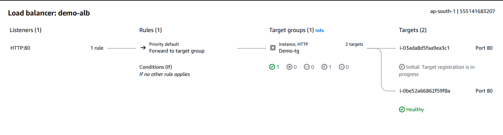

# ⚖️ AWS Application Load Balancer + Auto Scaling Group


This project demonstrates how to build a **highly available and fault-tolerant web application** on AWS using an **Application Load Balancer (ALB)** and an **Auto Scaling Group (ASG)**.

The architecture places the **Application Load Balancer in public subnets** while deploying **EC2 instances inside private subnets**, following AWS production best practices for security and availability.

---

## 📖 Table of Contents

* [Overview](#overview)
* [Architecture](#architecture)
* [Features](#features)
* [Why Public ALB & Private EC2](#why-public-alb--private-ec2)
* [Resources Created](#resources-created)
* [Prerequisites](#prerequisites)
* [Deployment Steps](#deployment-steps)
* [Verification](#verification)
* [Project Structure](#project-structure)
* [AWS Services Used](#aws-services-used)
* [Cleanup](#cleanup)
* [Future Improvements](#future-improvements)
* [Author](#author)

---

## 📌 Overview

This project extends the custom VPC architecture by adding a scalable and highly available web tier.

The deployed architecture includes:

* Application Load Balancer
* Auto Scaling Group
* Target Group
* Launch Template
* Security Groups
* Private EC2 Instances
* Public ALB

This setup ensures that traffic is automatically distributed across multiple EC2 instances while maintaining high availability across multiple Availability Zones.

---

## 🏗️ Architecture

<p align="center">

</p>

---

## ✨ Features

* ⚖️ Application Load Balancer
* 📈 Auto Scaling Group
* 🌐 Multi-AZ Deployment
* 🔒 Private EC2 Instances
* 🌍 Internet-facing Load Balancer
* ❤️ Health Checks
* 🎯 Target Groups
* 🔐 Security Group Isolation
* 🚀 High Availability

---

## 🔐 Why Public ALB & Private EC2

A common production architecture separates internet-facing resources from backend application servers.

### Public ALB

* Receives incoming internet traffic.
* Lives inside public subnets.
* Connected to the Internet Gateway.
* Routes requests to healthy backend servers.

### Private EC2 Instances

* Do not receive public IP addresses.
* Cannot be accessed directly from the internet.
* Accept traffic only from the ALB Security Group.
* Serve application traffic securely.

### Traffic Flow

```text
Internet
      │
      ▼
Application Load Balancer
      │
      ▼
Target Group
      │
      ▼
Auto Scaling Group
      │
      ▼
Private EC2 Instances
```

This architecture greatly improves security by ensuring that users can only access the application through the Load Balancer.

---

## 🧱 Resources Created

| Resource           | Name        | Purpose                                 |
| ------------------ | ----------- | --------------------------------------- |
| Security Group     | alb-sg      | Allows HTTP traffic from the Internet   |
| Security Group     | instance-sg | Allows HTTP only from the ALB           |
| Target Group       | demo-tg     | Routes traffic to healthy EC2 instances |
| Launch Template    | demo-lt     | Defines EC2 configuration               |
| Load Balancer      | demo-alb    | Distributes incoming traffic            |
| Auto Scaling Group | demo-asg    | Automatically manages EC2 instances     |

---

## 📋 Prerequisites

Before starting, ensure you already have:

* Custom VPC
* Two Public Subnets
* Two Private Subnets
* Internet Gateway
* Route Tables
* Security Groups
* EC2 Key Pair (optional)

---

## 🚀 Deployment Steps

### Step 1 — Create Security Groups

### ALB Security Group

| Type | Port | Source    |
| ---- | ---- | --------- |
| HTTP | 80   | 0.0.0.0/0 |

---

### Instance Security Group

| Type | Port | Source |
| ---- | ---- | ------ |
| HTTP | 80   | alb-sg |

Only the Application Load Balancer can communicate with backend EC2 instances.

---

### Step 2 — Create Target Group

Configuration:

| Setting           | Value     |
| ----------------- | --------- |
| Target Type       | Instances |
| Protocol          | HTTP      |
| Port              | 80        |
| Health Check Path | /         |

Do not manually register instances.

The Auto Scaling Group automatically handles registration.

---

### Step 3 — Create Launch Template

Configuration:

| Setting        | Value             |
| -------------- | ----------------- |
| AMI            | Amazon Linux 2023 |
| Instance Type  | t3.micro          |
| Security Group | instance-sg       |

User Data:

```bash
#!/bin/bash

mkdir -p /var/www/demo

cat <<EOF > /var/www/demo/index.html
<html>
<body>
<h1>Hello from $(hostname -f)</h1>
</body>
</html>
EOF

cd /var/www/demo

nohup python3 -m http.server 80 > /var/log/demo-server.log 2>&1 &
```

---

### Step 4 — Create Application Load Balancer

Configuration:

| Setting        | Value           |
| -------------- | --------------- |
| Scheme         | Internet-facing |
| Subnets        | Public Subnets  |
| Listener       | HTTP:80         |
| Target Group   | demo-tg         |
| Security Group | alb-sg          |

---

### Step 5 — Create Auto Scaling Group

Configuration:

| Setting          | Value                  |
| ---------------- | ---------------------- |
| Launch Template  | demo-lt                |
| Private Subnets  | Both AZs               |
| Target Group     | demo-tg                |
| Desired Capacity | 2                      |
| Minimum Capacity | 2                      |
| Maximum Capacity | 4                      |
| Health Checks    | Elastic Load Balancing |

Once created, the Auto Scaling Group automatically launches healthy EC2 instances across multiple Availability Zones.

---

## 🔍 Verification

Wait a few minutes until the instances become healthy.

Verify:

* ✅ Target Group shows healthy instances.
* ✅ ALB DNS name loads the website.
* ✅ Refreshing the page changes the hostname, proving requests are distributed across multiple EC2 instances.
* ✅ Terminating an instance automatically launches a replacement.

---

## 📂 Project Structure

```text
AWS-ALB-AutoScaling/
│
├── README.md
└── images/
    └── alb-asg-architecture.png
```

---

## 📚 AWS Services Used

* Amazon EC2
* Application Load Balancer
* Auto Scaling Group
* Launch Templates
* Target Groups
* Amazon VPC
* Security Groups
* Health Checks

---

## 🧹 Cleanup

To avoid unnecessary AWS charges:

1. Delete the Auto Scaling Group.
2. Delete the Application Load Balancer.
3. Delete the Target Group.
4. Delete the Launch Template.
5. Delete the Security Groups.

---

## 🚀 Future Improvements

You can further enhance this architecture by adding:

* HTTPS Listener using ACM Certificates
* Route 53 Custom Domain
* AWS WAF
* CloudFront CDN
* Target Tracking Scaling Policies
* Amazon RDS in Private Subnets
* NAT Gateway
* Terraform
* AWS CloudFormation
* GitHub Actions CI/CD Pipeline

---

## 👨‍💻 Author

**Ved Dandotia**

* 🌐 Portfolio: [techxved.me](https://techxved.me)
* 💼 LinkedIn: [Ved Dandotia](https://linkedin.com/in/ved-dandotia-b069a5329)
* 🐙 GitHub: [TechxVed](https://github.com/TechxVed)

---

## ⭐ Support

If you found this project helpful, consider giving it a **⭐ Star** on GitHub. It helps others discover the project and motivates me to create more AWS, Cloud, and DevOps projects.

Happy Cloud Learning! ☁️🚀
